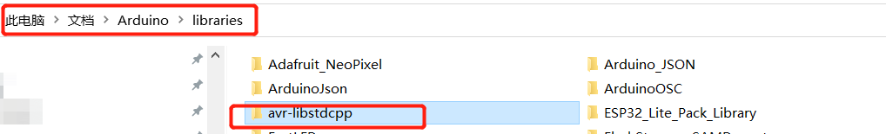
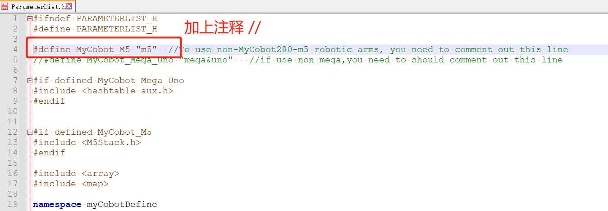
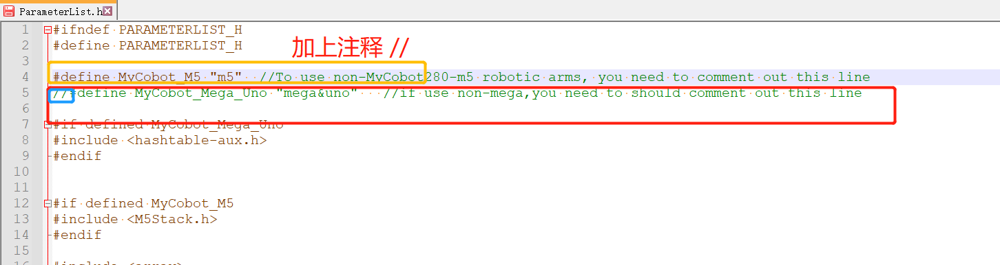

# 底部basic库
使用底部basic库您可以在Arduino下自由开发，控制我们公司的机械臂。
## 编译前的修改
* 首先：如果编译Mega2560或者Uno案例，请先剪切avr-libstdcpp（这是一个第三方avr-std c++库），粘贴到C:\Users\User\Documents\Arduino\libraries下： 

* 如果您使用的是myCobot280-Arduino，请打开ParameterList.h,将第四行加上注释： 

* 如果使用的是myCobot280-M5，不需要修改； 
* 如果使用的时Mega2560或者Uno开发板，打开ParameterList.h,取消第5行注释，同时将第四行加上注释： 

## 部分案例介绍：
1. MyPalletizerRoboFlow： 
MyPalletizer260使用案例，可以进行零位校准、拖动示教、通讯（在此基础上，使用RoboFlow、python、myblockly等控制机械臂）、信息获取（获取舵机 atom连接状态、以及basic、atom固件版本）。
2. miniRoboM5： 
myCobot280-M5使用案例，功能与MyPalletizerRoboFlow一样。
3. MKRBoard： 
myCobot280-Arduino和Mega2560开发板使用案例，功能主要是通讯，在此基础上，使用RoboFlow、python、myblockly等控制机械臂，进行io控制。 
4. UnoSetLed： Uno开发板使用案例，此案例只是简单进行了LED灯颜色的改变，可以在此基础上开发。

注意：Arduino环境配置及案例编译可以看我们的gitbook文档（https://docs.elephantrobotics.com/docs/gitbook/10-ArduinoEnv/）和哔哩哔哩上的视频（https://www.bilibili.com/video/BV1X3411W7Sn/）。