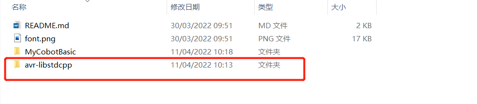
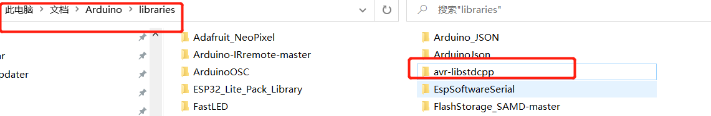
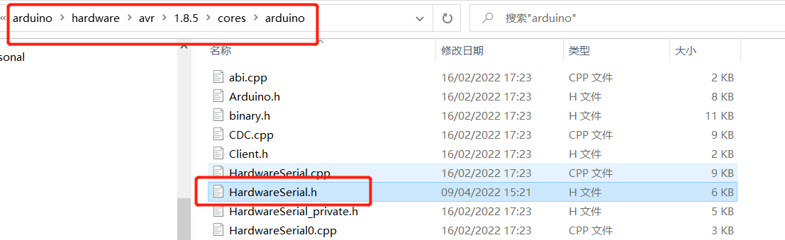
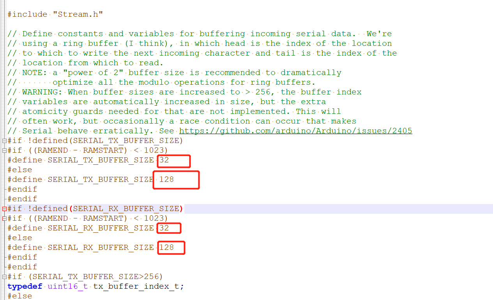
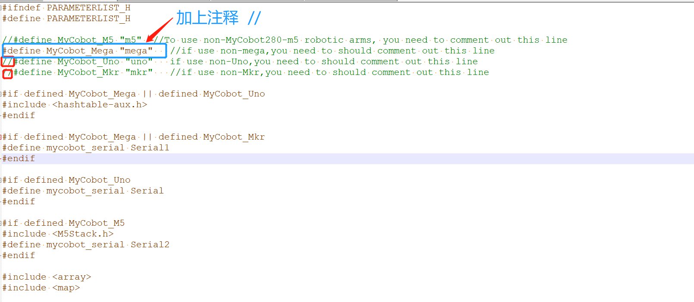
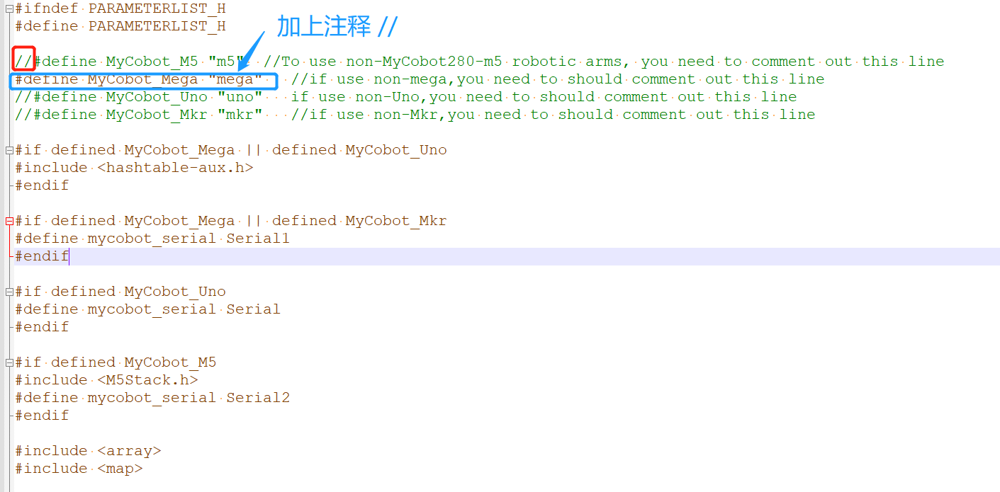
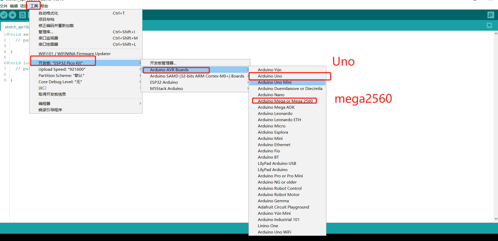
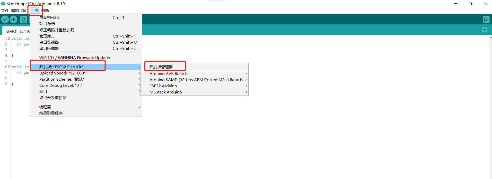
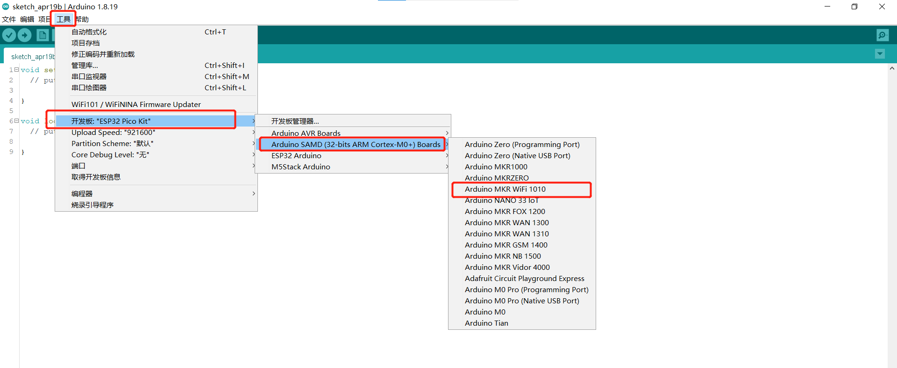

# 底部basic库
使用底部basic库您可以在Arduino下自由开发，控制我们公司的机械臂。 
## 编译前的修改
导入库文件，如果您的机械臂是myCobot280-Arduino，请检查开发板是否为Mega2560或者Uno，如果是： 
1. 请将**avr-libstdcpp**放到**C:\Users\User\Documents\Arduino\libraries**下: 
 
 
2. 请修改avr官方库里面串口缓冲区的大小，修改**C:\Users\User\AppData\Local\arduino15\packages\arduino\hardware\avr\1.8.5\cores\arduino\HardwareSerial.h**,按下图修改即可： 
 
 
如果您使用的是myCobot280-Arduino，请查看开发板是否为mega2560，如果不是，**请打开ParameterList.h**,**将第5行加上注释**，同时**取消相应开发板的注释**： 
 
如果使用的是myCobot280-M5，需要**取消m5的注释**： 
 

## 编译前开发板的选择
1. 开发板为Uno、Mega2560,工具--》开发板--》Arduino AVR Boards-->Arduino Uno（或者Arduino MEAG or Mega2560)，具体可看下图：  
 
2. 开发板为mkr wifi1010 
开发板管理器搜索samd，如果没有安装，就安装，首先工具--》开发板--》开发板管理器，然后搜索samd，具体可看下图： 
 
 
开发板选择mkr wifi1010，工具--》开发板--》Arduino SAMD--》Arduino MKR WiFi1010 
 

## 部分案例介绍：
1. MyPalletizerRoboFlow： 
MyPalletizer260使用案例，可以进行零位校准、拖动示教、通讯（在此基础上，使用RoboFlow、python、myblockly等控制机械臂）、信息获取（获取舵机 atom连接状态、以及basic、atom固件版本）。
2. miniRoboM5： 
myCobot280-M5使用案例，功能与MyPalletizerRoboFlow一样。
3. MKRBoard： 
myCobot280-Arduino和Mega2560开发板使用案例，功能主要是通讯，在此基础上，使用RoboFlow、python、myblockly等控制机械臂，进行io控制。 
4. ControlRobot： MyCobot280通用使用案例，案例中主要介绍了关节、坐标、夹爪等控制及信息获取，可以在此基础上开发，烧录此案例前，请将**机械臂固定**，案例中机械臂会进行坐标、关节、夹爪控制。

注意：Arduino环境配置及案例编译可以看我们的gitbook文档（https://docs.elephantrobotics.com/docs/gitbook/10-ArduinoEnv/） 和哔哩哔哩上的视频 （https://www.bilibili.com/video/BV1X3411W7Sn/）。