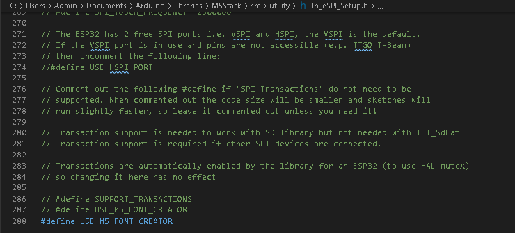

# 此文件夹内所有文件用于底部Basic

## 1.烧录前请确定设备连接成功

## 2.示例文件部分是带有中文显示的，编译时会提示错误，可修改库文件解决
* 如提示：mycobot_24px.h 文件错误

> 解决方法是到路径文件取消最后一行代码注释:   
> Windows ： `C:\Users\Admin\Documents\Arduino\libraries\M5Stack\src\utility/ln_eSPI_Setup.h`  
> Linux  :  `~/Arduino/libraries/M5Stack/src/utility/ln_eSPI_Setup.h`  

修改结果如下图：

 

## 3.如遇到示例代码无法运行，请检查固件是否为最新固件，如确定固件无问题，请联系客服解决。