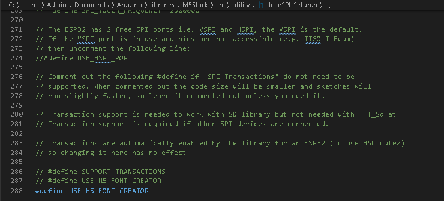

# myCobot: Arduino

Please review [root-level README](../) first!

# M5 Stack Basic

以上程序只适用于myCobot底座上的M5 Basic控制器进行使用
This robot only deals with M5 Basic Board only!

M5Stack Basic 的基本应用与烧录可以参考以下链接
Please refer to the following link for the basic application and programming of
M5Stack:

- <https://docs.m5stack.com/#/zh_CN/core/basic> (Chinese)
- <https://docs.m5stack.com/#/en/core/basic> (English)

# Library & Example 

To start, please see `MycobotBasic.h` and `MycobotBasic.cpp`

## Update on 4th Feb

Can only be used with AtomMain2.7 in myStudio1.0
https://github.com/elephantrobotics/myStudio/releases

```cc
setEncoder(servo_number, encoder)  // can use to set gripper,servo_number should be 7, encoder should be 0-4096, but if you want use gripper, must get Gripper Value and set gripper init.

getGripperValue() 	// return gripper encdoer value (from 0 to 4096)

setPWMOutput(pin_number, frequency，ratio) // pin_number should be 13/22/23/33, frequency should be 100-100000, ratio should be 0 to 256（128 means 50% pwm）；
```

# FAQ

如果您使用我们的库，并且需要运行历程,但是编译器提示mycobot_24px.h文件报错，那请您先修改语言配置  
* windows  
> 打开：" C:\Users\Admin\Documents\Arduino\libraries\M5Stack\src\utility/ln_eSPI_Setup.h "  
> 取消最后一句代码的注释,如图：


