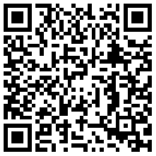
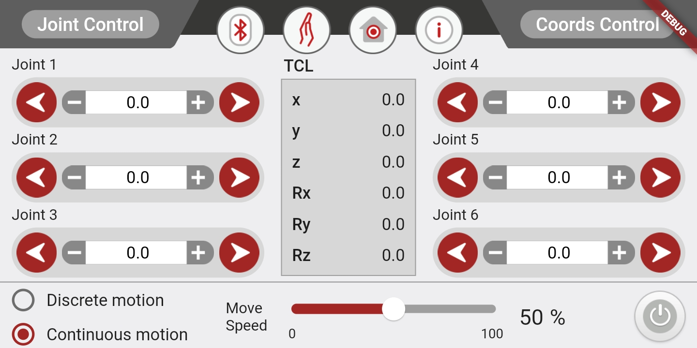
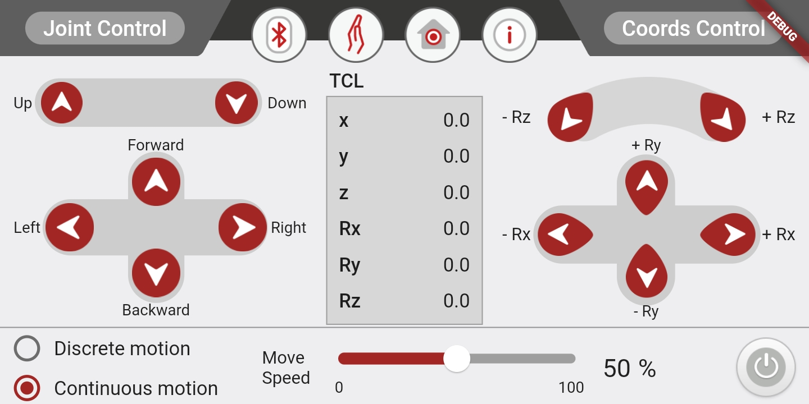

# myCobot phone controller

**This is a mobile app, used to simply control the mycobot.**[Download](https://github.com/elephantrobotics/myCobot/releases/tag/0.0.1)

- Please make sure flash `myCobotBLE` to your Basic.

You can choose to scan the **QR code** below to download the app:

## Screenshot

> It's only a preview at the moment.

